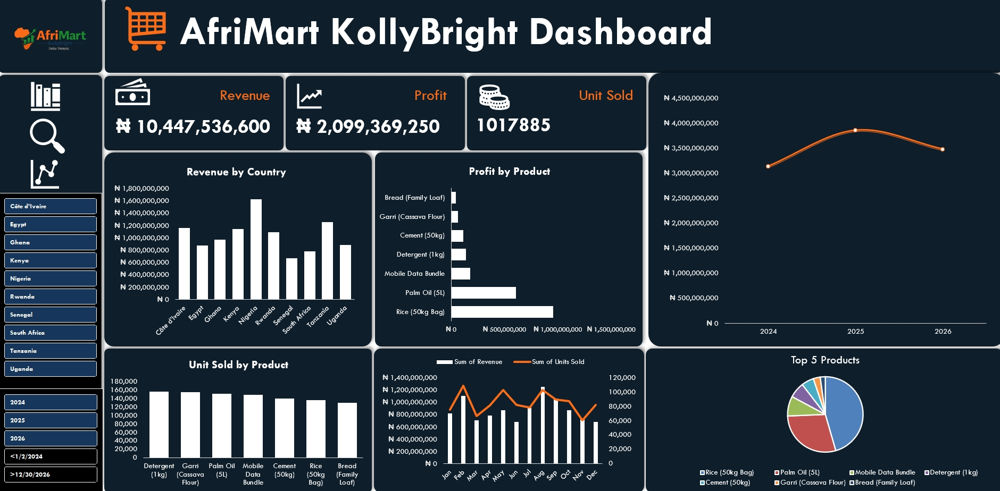

# Afrimart KollyBright Sales Dashboard (Excel)

## 📊 Project Overview
This project analyzes sales data for **Afrimart KollyBright**, a fictional African retail company.
The goal of the dashboard is to help management quickly understand sales performance,
profitability, and trends across countries and products using Microsoft Excel.

This project was created as part of a data analysis portfolio to demonstrate
Excel dashboarding, data summarization, and business insight skills.

---

## 🧩 Business Questions Answered
- What is the total revenue, profit, and units sold?
- Which countries generate the highest revenue?
- Which products are the most profitable?
- How does revenue change over time?
- Which products perform best in different regions?

---

## 📈 Key KPIs
- Total Revenue  
- Total Profit  
- Total Units Sold  
- Profit Margin  

---

## 🛠️ Tools Used
- Microsoft Excel  
- Pivot Tables  
- Pivot Charts  
- Excel Slicers  
- Dashboard Design Techniques  

---

## 📸 Dashboard Preview

---

## 🔍 Key Insights
- Nigeria contributed the highest share of total revenue.
- Some products recorded high sales volume but lower profit margins.
- Revenue trends show consistent growth over time.
- Product performance varies significantly by country.

---

## 📁 Files in This Repository
- [Sales Dataset](012 AfriMart_KollyBright_Sales_Dataset.xlsx)  
- [Dashboard Screenshot](AfriMart_KollyBright_Sales_Dashboard_in_Excel_Screenshot.jpg)  
- [Company Logo](logo_afrimart-logo.png)  
- README.md  

---

## 🚀 Conclusion
This project demonstrates how raw sales data can be transformed into
clear, interactive dashboards that support data-driven business decisions.
It highlights strong Excel fundamentals, analytical thinking,
and professional project documentation.
